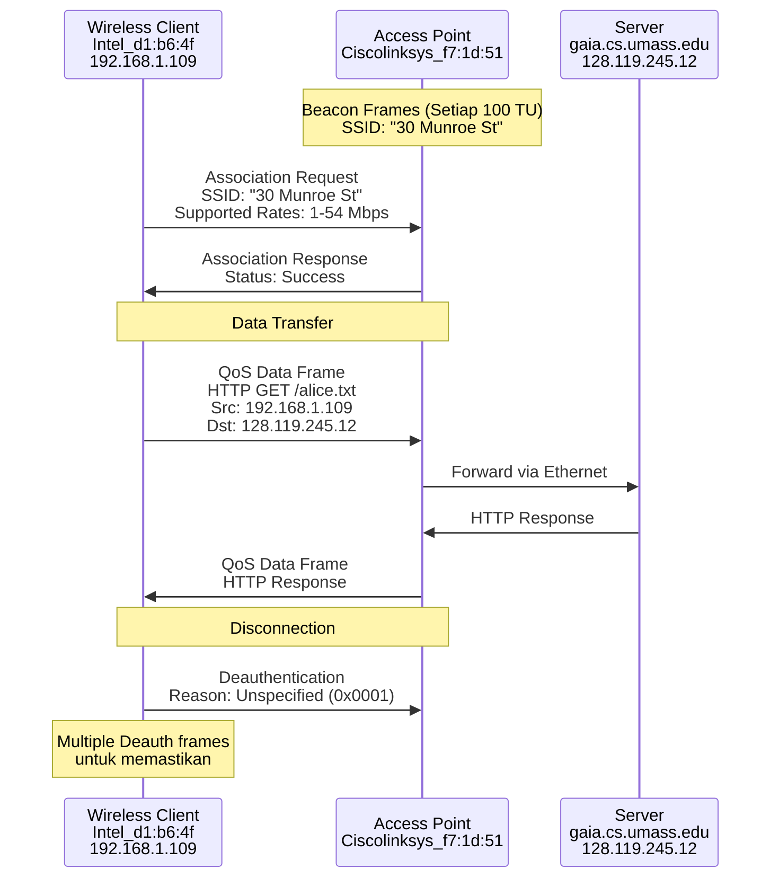

# Laporan Praktikum Jaringan Komputer - Modul 13
## 802.11 WiFi

### Identitas Praktikan
| Item | Keterangan |
|------|------------|
| **Nama** | Moh Irham Maulana |
| **NIM** | 103072400063 |
| **Kelas** | IF-04-01 |

---

## 1. Tujuan Praktikum
Berdasarkan modul praktikum Jaringan Komputer Semester Genap 2025/2026, tujuan dari Modul 13 adalah:
1. Mahasiswa dapat menginvestigasi cara kerja protokol WiFi 802.11 menggunakan Wireshark.
2. Mahasiswa mampu menganalisis struktur frame 802.11 (Beacon, Data, Management).
3. Mahasiswa memahami mekanisme asosiasi, disosiasi, dan transfer data pada jaringan nirkabel.
4. Mahasiswa dapat membedakan karakteristik frame 802.11 dengan frame Ethernet kabel.

---

## 2. Persiapan Tools
Karena keterbatasan driver NIC wireless dalam mendukung mode monitor untuk capture frame 802.11 asli, praktikum ini menggunakan file trace yang telah disediakan.

### 2.1 Wireshark
- **Status:** Terinstall dan berfungsi
- **Versi:** 4.0.3
- **Filter yang digunakan:** `wlan`, `wlan.fc.type_subtype`, `wlan_mgt`, `http`, `tcp.port == 80`
- **File Trace:** `Wireshark_802_11.pcap` (dari `wireshark-traces.zip`)

### 2.2 Referensi Dokumen
- *"A Technical Tutorial on the 802.11 Protocol"* - Pablo Brenner
- *"Understanding 802.11 Frame Types"* - Jim Geier
- **ANSI/IEEE Std 802.11, 1999 Edition (R2003)** - [Link PDF](http://gaia.cs.umass.edu/wireshark-labs/802.11-1999.pdf)

### 2.3 Spesifikasi Jaringan pada Trace
| Komponen | Keterangan |
|----------|-----------|
| **Access Point** | Cisco Linksys 802.11 (30 Munroe St) |
| **Channel** | 6 (2.437 GHz) |
| **Host Wireless** | Intel wireless NIC (Intel_d1:b6:4f) |
| **Capture Tool** | AirPcap + Wireshark |

---

## 3. Langkah Kerja
Berikut adalah langkah-langkah yang dilakukan selama praktikum Modul 13:

### 3.1 Persiapan dan Load Trace
1. Mengunduh file `wireshark-traces.zip` dari `http://gaia.cs.umass.edu/wireshark-labs/`.
2. Mengekstrak file `Wireshark_802_11.pcap`.
3. Membuka Wireshark dan memuat file trace melalui `File > Open`.
4. Mengamati tampilan awal daftar paket.

### 3.2 Analisis Beacon Frames
1. Memfilter paket dengan `wlan.fc.type_subtype == 8` (Beacon).
2. Memilih salah satu frame Beacon dari AP "30 Munroe St" (Frame 4).
3. Menganalisis field-field pada IEEE 802.11 Management Frame:
   - Beacon Interval, Capability Information
   - SSID, Supported Rates, Extended Supported Rates
   - ERP Information, Vendor Specific tags (WMM/WME)

### 3.3 Analisis Transfer Data (HTTP over 802.11)
1. Memfilter paket dengan `tcp.port == 80` untuk menemukan traffic HTTP.
2. Mengidentifikasi paket HTTP GET pada frame 480.
3. Menganalisis struktur frame 802.11 Data yang membawa payload IP/HTTP:
   - Frame Control, Duration, Address 1-4
   - QoS Control field
   - Payload: LLC/SNAP + IP + TCP + HTTP

### 3.4 Analisis Association/Disassociation
1. Memfilter paket management dengan `wlan.fc.type_subtype == 0` untuk Association Request.
2. Memfilter dengan `wlan.fc.type_subtype == 12` untuk Deauthentication.
3. Menganalisis frame:
   - **Deauthentication** (Subtype: 12) dengan reason code
   - **Association Request** (Subtype: 0) ke AP "30 Munroe St"
   - Supported Rates dan QoS Capability

---

## 4. Hasil dan Pembahasan

### 4.1 Tampilan Awal Wireshark dengan Trace 802.11

*Gambar 1: Tampilan Wireshark setelah membuka file Wireshark_802_11.pcap dengan berbagai frame 802.11.*

### 4.2 Analisis Beacon Frame
Beacon frame digunakan AP untuk mengiklankan keberadaan jaringan.

**Filter:** `wlan.fc.type_subtype == 8`


*Gambar 2: Detail Beacon Frame dari AP "30 Munroe St" (Frame 4).*

#### Field Penting Beacon Frame
| Field | Nilai | Keterangan |
|-------|-------|-----------|
| **Frame Control** | Type: Management (0), Subtype: Beacon (8) | Jenis frame |
| **Source MAC** | Ciscolinksys_f7:1d:51 | MAC Address AP |
| **Destination** | Broadcast (ff:ff:ff:ff:ff:ff) | Dikirim ke semua station |
| **Beacon Interval** | 100 TU (102.4 ms) | Frekuensi pengiriman beacon |
| **SSID** | "30 Munroe St" | Nama jaringan |
| **Supported Rates** | 1, 2, 5.5, 11, 6, 9, 12, 18 Mbps | Kecepatan dasar |
| **Extended Supported Rates** | 24, 36, 48, 54 Mbps | Kecepatan tambahan (802.11g) |
| **ERP Information** | Present | Extended Rate PHY (802.11g) |
| **DS Parameter Set** | Channel: 6 | Channel operasi AP |

#### Vendor Specific Tags
Beacon frame juga mengandung informasi vendor-specific:

**1. Airgo Networks, Inc. (Tag 221)**
- OUI: 00:0a:f5
- Vendor specific data untuk fitur proprietary

**2. Microsoft Corp. - WMM/WME Parameter Element (Tag 221)**
- OUI: 00:50:f2 (Microsoft)
- Type: WMM/WME (0x02)
- WME Subtype: Parameter Element (1)
- WME Version: 1
- WME QoS Info: 0x0f
  - U-APSD: Disabled
  - Parameter Set Count: 0xf

**AC (Access Category) Parameters untuk QoS:**
| AC | AIFSN | ECWmin/max | TXOP Limit |
|----|-------|------------|------------|
| **AC 0 (Best Effort)** | 3 | 4/10 (15/1023) | 0 |
| **AC 1 (Background)** | 7 | 4/10 (15/1023) | 0 |
| **AC 2 (Video)** | 2 | 3/4 (7/15) | 94 |
| **AC 3 (Voice)** | 2 | 2/3 (3/7) | 47 |

> **Catatan:** Parameter QoS (WMM) menunjukkan prioritas untuk different traffic types. Voice dan Video memiliki TXOP Limit yang lebih tinggi untuk kualitas layanan yang lebih baik.

### 4.3 Analisis Association Request
**Filter:** `wlan.fc.type_subtype == 0`


*Gambar 3: Frame Association Request dari Intel wireless client ke AP "30 Munroe St".*

#### Detail Association Request (Frame 1750)
| Field | Nilai | Keterangan |
|-------|-------|-----------|
| **Frame Control** | Type: Management, Subtype: Association Request (0) |
| **Transmitter Address** | Intel_d1:b6:4f (00:13:02:d1:b6:4f) | MAC client |
| **Receiver Address** | Ciscolinksys_f7:1d:51 (00:16:b6:f7:1d:51) | MAC AP |
| **BSSID** | Ciscolinksys_f7:1d:51 | MAC AP |
| **Sequence Number** | 1648 |
| **Capability Info** | 0x0c01 |
| **Listen Interval** | 0x000a (10 beacon intervals) |
| **SSID** | "30 Munroe St" (Length: 12) |

#### Supported Rates dalam Association Request
**Tag: Supported Rates (Tag 1):**
- 1(B), 2(B), 5.5(B), 11(B) - Basic rates (802.11b)
- 6(B), 9, 12(B), 18 Mbps - Basic rates (802.11g)

**Tag: Extended Supported Rates (Tag 50):**
- 24(B), 36, 48, 54 Mbps - Extended rates

**Tag: QoS Capability (Tag 46):**
- QoS Information (STA): 0x00
- Client mendukung QoS/WMM

### 4.4 Analisis Deauthentication Frame
**Filter:** `wlan.fc.type_subtype == 12`


*Gambar 4: Frame Deauthentication dari client ke AP.*

#### Detail Deauthentication (Frame 1735)
| Field | Nilai | Keterangan |
|-------|-------|-----------|
| **Frame Control** | Type: Management, Subtype: Deauthentication (12) |
| **Source Address** | Intel_d1:b6:4f (00:13:02:d1:b6:4f) |
| **Destination Address** | Ciscolinksys_f7:1d:51 (00:16:b6:f7:1d:51) |
| **BSSID** | Ciscolinksys_f7:1d:51 |
| **Reason Code** | 0x0001 (Unspecified reason) |

**Penjelasan:** Client mengirimkan frame Deauthentication untuk memutuskan koneksi dari AP. Reason code 1 menunjukkan "Unspecified reason" - alasan umum untuk disconnection.

Terlihat multiple deauthentication frames (frames 1735, 2142, 2143, 2144, 2145, 2146, 2147, 2148, 2149) yang dikirim secara berulang, menunjukkan client berusaha memastikan AP menerima notifikasi deauthentication.

### 4.5 Analisis Transfer Data HTTP over 802.11
**Filter:** `tcp.port == 80`


*Gambar 5: Frame 802.11 Data yang membawa HTTP GET request (Frame 480).*

#### Informasi Paket HTTP
| Field | Nilai |
|-------|-------|
| **Frame Number** | 480 |
| **Time** | 24.828253 detik |
| **Source IP** | 192.168.1.109 |
| **Destination IP** | 128.119.245.12 (gaia.cs.umass.edu) |
| **Protocol** | HTTP |
| **Request** | GET /wireshark-labs/alice.txt HTTP/1.1 |

#### Struktur Address pada Frame 802.11 Data (Infrastructure Mode)
| Address Field | Nilai | Peran |
|--------------|-------|-------|
| **Receiver Address (RA)** | Ciscolinksys_f4:eb:a8 (00:16:b6:f4:eb:a8) | MAC AP (Address 1) |
| **Transmitter Address (TA)** | Intel_d1:b6:4f (00:13:02:d1:b6:4f) | MAC Client (Address 2) |
| **Destination Address (DA)** | Ciscolinksys_f4:eb:a8 (00:16:b6:f4:eb:a8) | MAC AP (Address 3) |
| **Source Address (SA)** | Intel_d1:b6:4f (00:13:02:d1:b6:4f) | MAC Client (Address 4 - STA address) |
| **BSSID** | Ciscolinksys_f7:1d:51 (00:16:b6:f7:1d:51) | MAC AP |

> **Penting:** Frame 802.11 menggunakan 4 address fields dalam infrastructure mode, berbeda dengan Ethernet yang hanya menggunakan 2 address (source dan destination).

#### Frame Control Field
```
Type/Subtype: QoS Data (0x0028)
  Type: Data frame (2)
  Subtype: 8 (QoS Data)
  
Flags: 0x01
  DS status: Frame from STA to DS via an AP (To DS: 1 From DS: 0)
  More Fragments: This is the last fragment
  Retry: Frame is not being retransmitted
  PWR MGT: STA will stay up
  More Data: No data buffered
  Protected flag: Data is not protected
  +HTC/Order flag: Not strictly ordered
```

#### QoS Control Field
```
QoS Control: 0x0000
  TID: 0 (Best Effort)
  Priority: Best Effort (0)
  Ack Policy: Normal Ack (0x0)
  Payload Type: MSDU
  TXOP Duration Requested: 0 (no TXOP requested)
```

#### Payload Structure
```
IEEE 802.11 Data Frame Body:
├─ LLC/SNAP Header
│  ├─ DSAP: 0xaa
│  ├─ SSAP: 0xaa
│  ├─ Control: 0x03
│  └─ OI: 00-00-00 (Null)
├─ SNAP Protocol Type: IPv4 (0x0800)
├─ IP Header
│  ├─ Source: 192.168.1.109
│  ├─ Destination: 128.119.245.12
│  └─ Protocol: TCP (6)
├─ TCP Header
│  ├─ Source Port: 2538
│  ├─ Destination Port: 80 (HTTP)
│  ├─ Seq: 1, Ack: 1
│  └─ Len: 435
└─ HTTP Protocol
   └─ GET /wireshark-labs/alice.txt HTTP/1.1
      Host: gaia.cs.umass.edu
      User-Agent: Mozilla/5.0...
      Accept: text/xml,application/xml...
```

### 4.6 Perbandingan Frame 802.11 dengan Ethernet

| Aspek | Ethernet (802.3) | 802.11 WiFi |
|-------|------------------|-------------|
| **Address Fields** | 2 (Source, Destination) | 4 (Address 1-4) |
| **Frame Types** | Data only | Management, Control, Data |
| **Medium Access** | CSMA/CD | CSMA/CA |
| **Frame Check** | FCS (CRC-32) | FCS (CRC-32) |
| **Fragmentation** | Tidak ada | Didukung |
| **QoS** | 802.1p (VLAN tag) | WMM/WME (802.11e) |
| **Power Management** | Tidak ada | Didukung |

### 4.7 Sequence Number dan Fragment Number
Dari analisis frame-frame yang diamati:

**Beacon Frame (Frame 4):**
- Sequence Number: 2854
- Fragment Number: 0

**Association Request (Frame 1750):**
- Sequence Number: 1607
- Fragment Number: 0

**Deauthentication (Frame 1735):**
- Sequence Number: 1605
- Fragment Number: 0

**HTTP Data (Frame 480):**
- Sequence Number: 51
- Fragment Number: 0

> **Catatan:** Sequence Number digunakan untuk mengidentifikasi frame dan mendeteksi duplikasi. Fragment Number digunakan jika frame dipecah menjadi beberapa fragmen (semua frame dalam trace ini tidak terfragmentasi, Fragment Number = 0).

### 4.8 Timeline Komunikasi Wireless



### 4.9 Analisis Traffic Pattern

Dari packet list (Screenshot 5), terlihat pola traffic yang khas:

1. **Beacon Frames (Frame 1, 4, 9, 11, 13, ...)**
   - Dikirim secara periodic oleh AP
   - Sequence Number meningkat (2854, 2855, 2856, ...)
   - Interval: ~100ms (100 TU)

2. **Management Frames**
   - Association Request/Response
   - Probe Request/Response
   - Deauthentication

3. **Data Frames**
   - QoS Data frames untuk HTTP traffic
   - Acknowledgement frames

4. **Control Frames**
   - Acknowledgement (ACK)
   - QoS Null function (untuk power management)