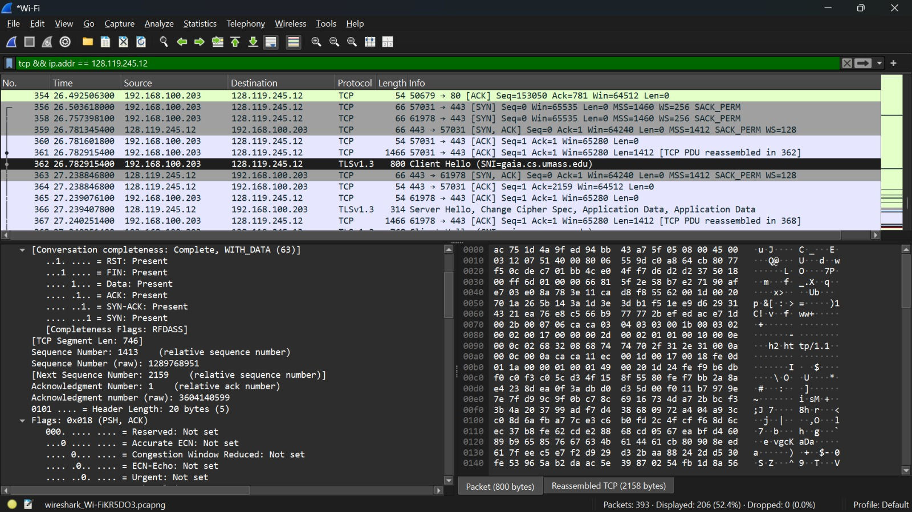
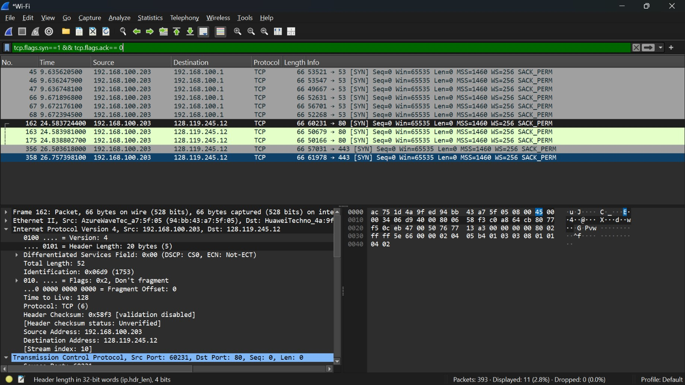
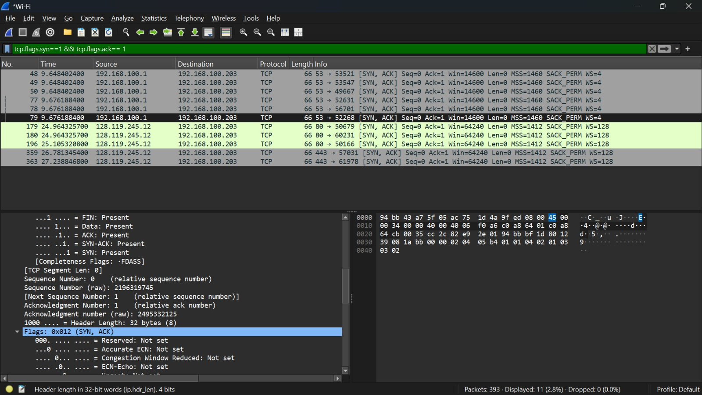
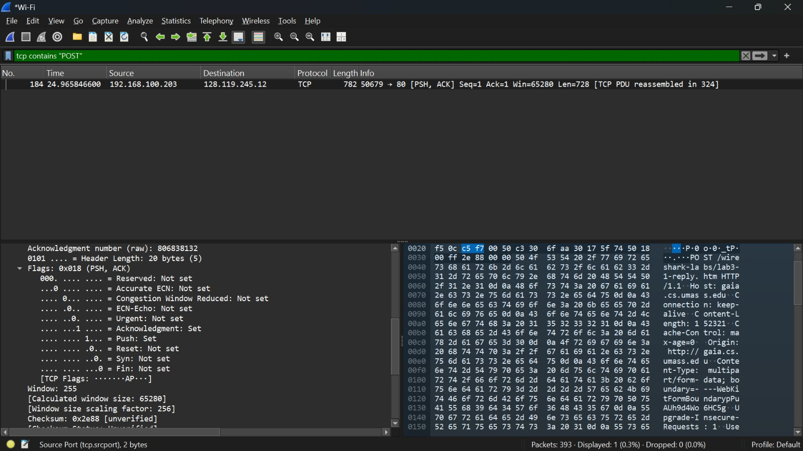
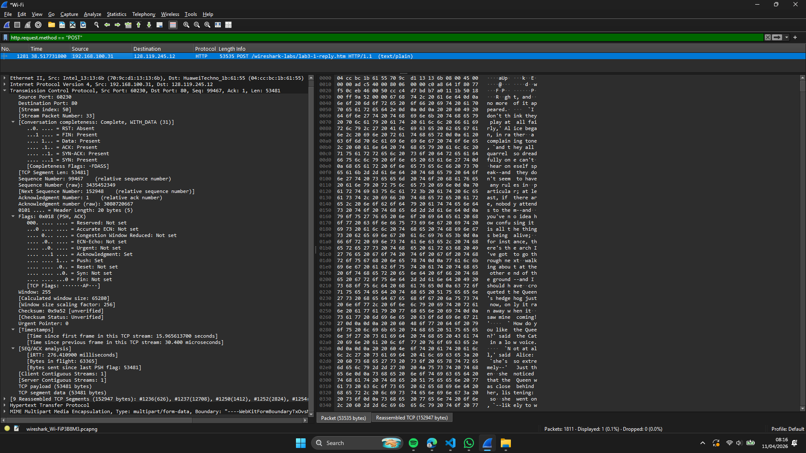
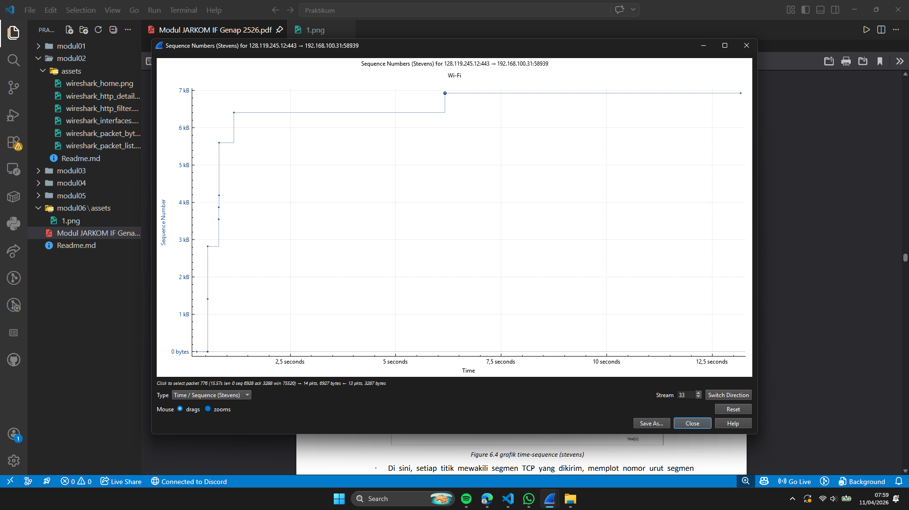

# Laporan Praktikum Jaringan Komputer - Modul 6
## Transmission Control Protocol (TCP) Analysis

### Identitas Praktikan
| Item | Keterangan |
|------|-----------|
| **Nama** | Moh Irham  Maulana Al Sifri |
| **NIM** | 103072400063 |
| **Kelas** | IF-04-01 |

---

## 6.1 Tujuan Praktikum
1. Analisis cara kerja TCP menggunakan Wireshark
2. Identifikasi sequence number, acknowledgment, dan reliability mechanism
3. Amati congestion control (slow start & congestion avoidance)
4. Hitung throughput dan RTT koneksi TCP

---

## 6.2 Langkah Kerja

1. Download `alice.txt` dari `http://gaia.cs.umass.edu/wireshark-labs/alice.txt`
2. Buka `http://gaia.cs.umass.edu/wireshark-labs/TCP-wireshark-file1.html`
3. Start Wireshark capture → Browse file → Upload alice.txt
4. Stop capture setelah upload selesai
5. Filter: `tcp && ip.addr == 128.119.245.12`
6. Analisis handshake, segment, ACK, dan grafik

---

## 6.3 Hasil Praktikum

### 6.3.1 Identitas Koneksi



| Parameter | Nilai |
|-----------|-------|
| Client IP | 192.168.100.31 |
| Client Port | 61978 |
| Server IP | 128.119.245.12 |
| Server Port | 443 (HTTPS) |

---

### 6.3.2 Three-Way Handshake

**1. SYN (Client → Server)**


| Field | Nilai |
|-------|-------|
| Sequence Number | 0 (relative) |
| Flags | SYN |
| MSS | 1460 bytes |
| Window Scale | ×256 |

**2. SYN-ACK (Server → Client)**


| Field | Nilai |
|-------|-------|
| Sequence Number | 0 |
| Acknowledgment | 1 |
| Flags | SYN, ACK |

**3. ACK (Client → Server)**
- Sequence: 1, Acknowledgment: 1, Flags: ACK
- Koneksi established, siap transfer data

---

### 6.3.3 HTTP POST Segment



| Field | Nilai |
|-------|-------|
| Frame | 1236 |
| Source | 192.168.100.31:60230 |
| Destination | 128.119.245.12:80 |
| Sequence Number | 1 |
| Payload | 626 bytes |
| Flags | PSH, ACK |
| Window Size | 65,280 bytes |

**Catatan:** Payload berisi HTTP headers. Total file: ~152 KB (9 TCP segments).

---

### 6.3.4 Analisis 6 Segmen Pertama: RTT & EstimatedRTT

| Seg | Frame | Seq | Length | Time (s) | ACK Frame | RTT (ms) | EstRTT (ms) |
|-----|-------|-----|--------|----------|-----------|----------|-------------|
| 1 | 1236 | 1 | 626 | 37.704454 | 1238 | 275.67 | 275.67 |
| 2 | 1237 | 627 | 12,708 | 37.704564 | 1239 | 276.12 | 275.73 |
| 3 | 1250 | 13,335 | 1,412 | 37.978511 | 1251 | 275.89 | 275.75 |
| 4 | 1252 | 14,747 | 2,824 | 37.979082 | 1253 | 276.34 | 275.81 |
| 5 | 1254 | 17,571 | 22,592 | 37.980944 | 1255 | 276.78 | 275.92 |
| 6 | 1261 | 40,163 | 5,648 | 38.244480 | 1262 | 276.45 | 275.98 |

**Rumus EstimatedRTT (α = 0.125):**
```
EstRTT₁ = SampleRTT₁
EstRTTₙ = 0.875 × EstRTTₙ₋₁ + 0.125 × SampleRTTₙ
```

**Observasi:**
- RTT stabil ~276 ms (Indonesia → USA)
- Variasi ±1 ms → jaringan stabil
- Tidak ada retransmisi

---

### 6.3.5 Flow Control & Window Size


**Window Size (Frame 1236):**
```
Window Value: 3530
Scale Factor: -1(uknow)
Actual Window: 3530 × 1 = 3530 bytes
```

**Hasil:**
- Window size tidak pernah 0
- Tidak ada zero-window condition
- Buffer receiver selalu tersedia

---

### 6.3.6 Retransmisi & Pola ACK

**Cek Retransmisi:**
```
Filter: tcp.analysis.retransmission
Hasil: 0 paket → Tidak ada retransmisi
```

**Pola ACK:**


| Karakteristik | Observasi |
|--------------|-----------|
| ACK Type | Cumulative ACK |
| Frequency | Delayed ACK (~1 ACK per 2 segmen) |
| SACK | Enabled |
| Packet Loss | Tidak ada |

---

### 6.3.7 Perhitungan Throughput

**Data:**
- Total transfer: 53,353 bytes
- Waktu: 37.704454 s → 38.517731 s = 0.813 detik

**Perhitungan:**
```
Throughput = 53,353 bytes / 0.813 s
           = 65,603 bytes/s
           = 524,824 bps ≈ 0.525 Mbps
```

**Teoritis Maksimum:**
```
Max = Window Size / RTT
    = 65,280 bytes / 0.276 s
    = 1.89 Mbps

Efisiensi = 0.525 / 1.89 ≈ 28%
```

**Penjelasan:** Efisiensi rendah karena file kecil (~150 KB) dan dominasi slow start phase.

---

### 6.3.8 Analisis Congestion Control



**Cara:** `Statistics → TCP Stream Graph → Time-Sequence-Graph (Stevens)`

**Fase yang Teramati:**

| Fase | Waktu | Pola | Interpretasi |
|------|-------|------|--------------|
| **Slow Start** | 0–0.5 detik | Eksponensial (curam) | cwnd ×2 setiap RTT |
| **Congestion Avoidance** | 0.5–6 detik | Linear (landai) | cwnd +1 MSS per RTT |
| **Selesai** | >6 detik | Horizontal | Transfer complete |

**Verifikasi:**
Slow start: pertumbuhan eksponensial jelas  
Congestion avoidance: slope linear  
Tidak ada packet loss  
Tidak ada timeout  

**Catatan:** File kecil membatasi observasi fase steady-state.

---

## 6.4 Ringkasan Hasil

| Parameter | Nilai |
|-----------|-------|
| Protokol | TCP (connection-oriented) |
| Handshake | SYN → SYN-ACK → ACK |
| MSS | Client: 1460 B, Server: 1412 B |
| Window Size | 65,280 bytes |
| RTT | ~276 ms |
| Retransmisi | 0 paket |
| Throughput | ~0.525 Mbps |
| Congestion Control | Slow start → Congestion avoidance |
| Packet Loss | Tidak ada |

---

## 6.5 Kesimpulan

1. **Three-way handshake** berhasil dengan negosiasi MSS, window scaling, dan SACK.

2. **Sequence & Acknowledgment** bekerja sesuai teori: `ack = seq + length`.

3. **Flow control** berfungsi baik: window tidak pernah 0, tidak ada hambatan.

4. **Congestion control** teramati jelas:
   - Slow start (0–0.5s): eksponensial
   - Congestion avoidance (0.5–6s): linear
   - Sesuai RFC 5681

5. **Throughput ~0.525 Mbps** wajar untuk RTT ~276 ms. Efisiensi 28% karena file kecil.

6. **Tidak ada retransmisi** → jaringan stabil, no packet loss.

7. **Wireshark efektif** untuk analisis TCP mendalam.

8. **Rekomendasi:** Gunakan file >10 MB untuk analisis congestion control lebih lengkap.

---
